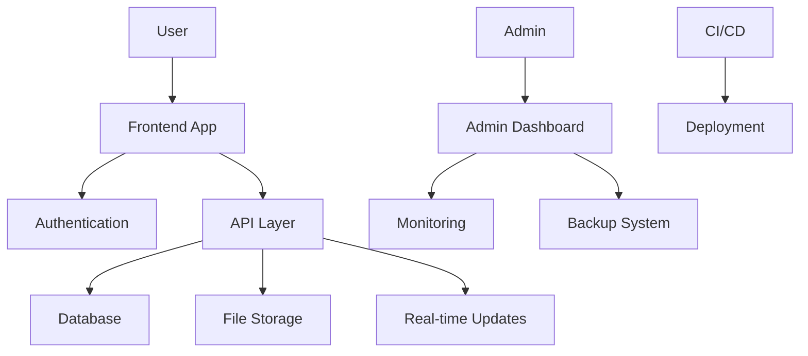

# EcoTale24hr System Architecture

## Overview

EcoTale24hr is a web-based recycling tracking application built with modern technologies and best practices for security, scalability, and user experience.

## Technology Stack

### Frontend
- React 18 with TypeScript
- Tailwind CSS for styling
- Zustand for state management
- React Query for data fetching
- Chart.js for data visualization

### Backend
- Supabase for backend services
- PostgreSQL database
- Row Level Security (RLS)
- Real-time subscriptions
- Edge Functions

### Infrastructure
- Netlify for frontend hosting
- Supabase for backend hosting
- AWS S3 for backup storage
- GitHub Actions for CI/CD

## Core Components

### 1. Authentication System
- Supabase Auth integration
- JWT-based authentication
- Multi-factor authentication support
- Session management
- Password policies enforcement

### 2. Data Management
- Real-time database updates
- Row Level Security policies
- Data validation middleware
- Automated backups
- Point-in-time recovery

### 3. Security Features
- Content Security Policy (CSP)
- Secure headers implementation
- CORS configuration
- XSS protection
- CSRF protection

### 4. Monitoring & Logging
- Sentry for error tracking
- LogRocket for session replay
- Performance monitoring
- Audit logging
- Security event tracking

### 5. Privacy Controls
- GDPR compliance features
- User consent management
- Data export functionality
- Data deletion workflows
- Privacy policy enforcement

## System Interactions

## Security Architecture

### 1. Access Control
- Role-based access control (RBAC)
- Fine-grained permissions
- Session management
- API authentication

### 2. Data Protection
- Data encryption at rest
- TLS for data in transit
- Secure key management
- Backup encryption

### 3. Monitoring & Alerts
- Real-time security monitoring
- Automated threat detection
- Incident response system
- Security event logging

## Backup & Recovery

### 1. Backup Strategy
- Daily incremental backups
- Weekly full backups
- Monthly archives
- Encrypted backup storage

### 2. Recovery Procedures
- Point-in-time recovery
- Disaster recovery plan
- Business continuity procedures
- Data integrity verification

## Performance Optimization

### 1. Frontend Optimization
- Code splitting
- Lazy loading
- Asset optimization
- Caching strategies

### 2. Backend Optimization
- Query optimization
- Connection pooling
- Caching layer
- Rate limiting

## Deployment Architecture

### 1. CI/CD Pipeline
- Automated testing
- Security scanning
- Performance testing
- Automated deployment

### 2. Environment Management
- Development environment
- Staging environment
- Production environment
- Feature flags

## Monitoring & Alerting

### 1. Application Monitoring
- Error tracking
- Performance metrics
- User analytics
- Resource utilization

### 2. Security Monitoring
- Security event logging
- Threat detection
- Compliance monitoring
- Access logging

## Scalability Considerations

### 1. Database Scalability
- Connection pooling
- Read replicas
- Sharding strategy
- Query optimization

### 2. Application Scalability
- Horizontal scaling
- Load balancing
- Caching strategy
- Resource optimization

## Compliance & Auditing

### 1. Compliance Features
- GDPR compliance
- Data privacy controls
- Audit logging
- Policy enforcement

### 2. Audit Capabilities
- User activity tracking
- System change logging
- Security event logging
- Compliance reporting

## Future Considerations

### 1. Planned Improvements
- Enhanced analytics
- Machine learning integration
- Mobile application
- API marketplace

### 2. Scalability Plans
- Global CDN integration
- Multi-region deployment
- Enhanced caching
- Performance optimization

## Documentation & Support

### 1. Technical Documentation
- API documentation
- Integration guides
- Security procedures
- Deployment guides

### 2. Support Resources
- Troubleshooting guides
- FAQs
- Support contact
- Incident response procedures 